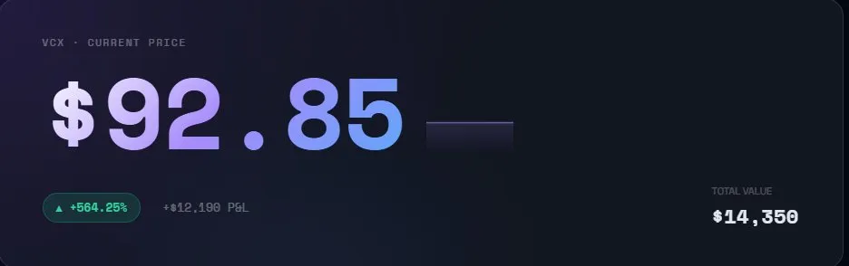
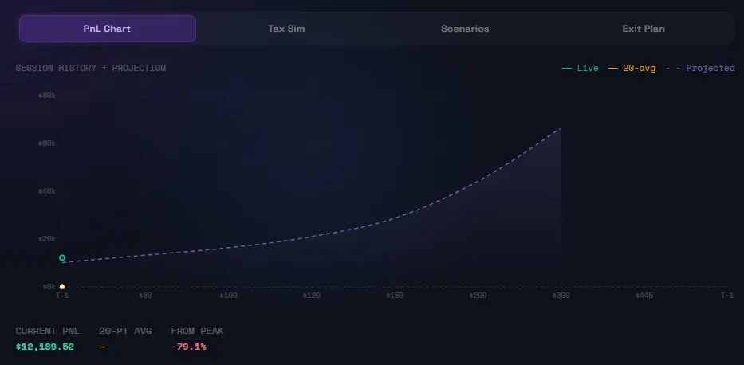
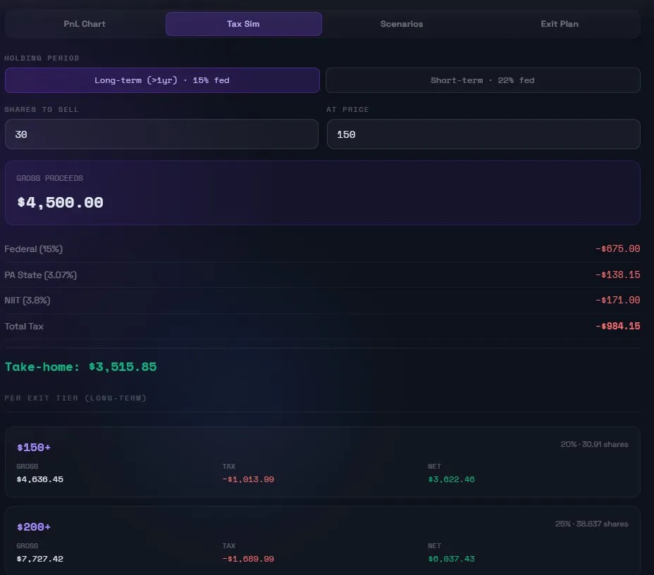

# VCX Position Dashboard

A personal investment tracking and decision system built for monitoring a locked equity position in VCX. Built with Next.js 16, Recharts, Python, and GitHub Actions — deployed on Vercel.

> **Live demo:** [vcxtracking-dashboard.vercel.app](https://vcxtracking-dashboard.vercel.app)

---

## Screenshots

### Hero Price Card


### PnL Chart — Session History + Projection


### Tax Simulator


---

## What it does

This isn't just a price tracker. It's a full decision engine designed to remove emotion from investment decisions on a single illiquid position with a lock-up period.

**Live price pipeline**
- Authenticates with the Public.com personal API (`/userapiauthservice/personal/access-tokens`)
- Fetches the brokerage account ID, then queries live VCX quotes (`/userapigateway/marketdata/{accountId}/quotes`)
- Refreshes every 30 seconds on the client with soft error handling for market-closed hours

**Decision panel**
- Computes a next best action (`HOLD / WATCH CLOSELY / SELL 20% / SCALE OUT HARD`) from live price against exit plan thresholds
- Shows return per day, days held, and total return — all animating with count-up on every price update
- Risk zone badge in the header updates live (DANGER / CAUTION / OPPORTUNITY / TARGET)

**PnL chart**
- Session price history recorded in-browser (up to 60 data points per session)
- Blends live history (green area) with a projected PnL curve (purple dashed) across price targets $80–$445
- 20-point rolling average overlaid in amber
- Hover tooltips show exact P&L and price at each point
- Sparkline next to the hero price showing recent trend

**Tax simulator**
- PA-specific tax calculation: federal (15% long / 22% short) + PA state (3.07%) + NIIT (3.8% long-term)
- Custom shares × price input for any hypothetical sale
- Per-exit-tier breakdown (gross → tax → net) for each planned sell zone
- Long/short term toggle applies globally across all tax calculations

**Decision tools**
- **Minimum win lock** — exact shares to sell at current price to recover full investment, plus free-roll shares remaining
- **Break-even after tax** — price needed to walk away with original investment after all applicable taxes
- **Sell pressure simulator** — enter shares to sell, see net proceeds after tax + what remaining shares are worth at each target
- **Recovery targets** — % move needed to reach $150 / $200 / $300 / $445 from current price
- **Goal-based exit** — maps portfolio value to personal financial goals (emergency fund, car fund, etc.) with live ✅ when reached
- **Worst case acceptance** — $60 floor scenario showing portfolio is still 4x even at worst case
- **Risk zones** — color-coded price bands with live highlighting
- **Scenario calculator** — full position value across 8 price points with hover tax tooltips

**Alert system (GitHub Actions + Discord)**
- Python script (`scripts/vcx_alert.py`) runs on GHA cron every 5 minutes during market hours
- Sends rich Discord embeds (colored sidebar, inline fields) when price crosses high/low thresholds
- Market open (9:30 AM ET, purple embed) and close (4:00 PM ET, green/red embed) summaries
- State cached between GHA runs to detect threshold crossings vs sustained levels
- Browser notifications (via Web Notifications API) fire in-app when tab is open

---

## Tech stack

| Layer | Tech |
|---|---|
| Framework | Next.js 16.2 (App Router, Turbopack) |
| Language | TypeScript (strict) |
| Styling | Inline CSS + CSS-in-JS via `<style>` tag |
| Charts | Recharts (AreaChart, ResponsiveContainer) |
| Animations | requestAnimationFrame count-up hook, CSS keyframes |
| API routes | Next.js Route Handlers (`app/api/vcx-price/route.ts`) |
| Data source | Public.com Personal API |
| Alerts | Python 3.11 + requests, GitHub Actions cron |
| Notifications | Discord Webhooks (rich embeds), Web Notifications API |
| Deployment | Vercel (auto-deploy from GitHub main) |
| Secrets | GitHub Actions Secrets + Vercel Environment Variables |

---

## Project structure

```
vcx_dashboard/
├── app/
│   ├── api/
│   │   └── vcx-price/
│   │       └── route.ts        # Live price API route (auth → account → quote)
│   ├── vcx/
│   │   └── page.tsx            # Main dashboard
│   ├── layout.tsx
│   ├── globals.css
│   └── page.tsx                # Root redirect → /vcx
├── scripts/
│   └── vcx_alert.py            # Discord alert checker
├── .github/
│   └── workflows/
│       └── vcx-alert.yml       # GHA cron workflow
├── screenshots/                # README screenshots
└── next.config.ts
```

---

## Local development

**Prerequisites:** Node.js 18+, npm

```bash
git clone https://github.com/JTrust-Process/vcxtracking_dashboard
cd vcxtracking_dashboard
npm install
```

Create `.env.local`:
```
PUBLIC_SECRET=your_public_api_secret_here
```

```bash
npm run dev
# → http://localhost:3000  (redirects to /vcx)
```

---

## Alert system setup

**GitHub Secrets required:**
```
PUBLIC_SECRET          — Public.com API secret
DISCORD_WEBHOOK_URL    — Discord channel webhook URL
VCX_ALERT_HIGH         — High price threshold (e.g. 150)
VCX_ALERT_LOW          — Low price threshold (e.g. 90)
```

**Manual trigger:**
Go to Actions → VCX Price Alert → Run workflow → choose mode:
- `alert` — check thresholds only
- `summary-open` — send market open embed
- `summary-close` — send market close embed

---

## Key engineering decisions

**Why inline CSS instead of Tailwind classes?**
The dashboard uses complex dynamic styles (aurora gradients, risk zone colors, animated fills) that don't map well to Tailwind utility classes. Inline styles give precise control without a build step for custom values.

**Why not persist price history?**
Price history is intentionally session-only. The chart combines live session data with a static projection curve — persisting history would add database complexity for marginal value since the projection curve already covers future scenarios.

**Why GitHub Actions for alerts instead of Vercel crons?**
Vercel cron jobs require a paid plan for runs more frequent than once per day. GitHub Actions free tier supports every 5 minutes during market hours at zero cost.

**Why Public.com API instead of a market data provider?**
VCX is held in a Public.com brokerage account. The position data comes from the same API, making it the natural single source of truth rather than stitching together a separate market data feed.

---

## License

Personal project — not intended for public use or redistribution.